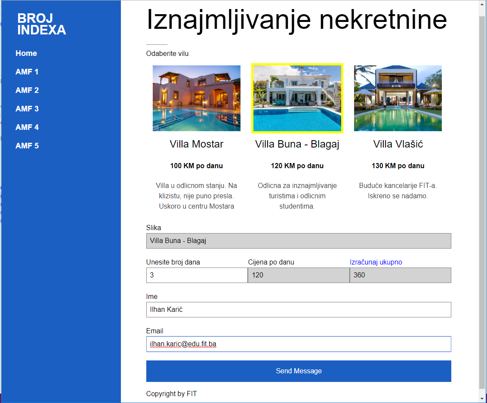
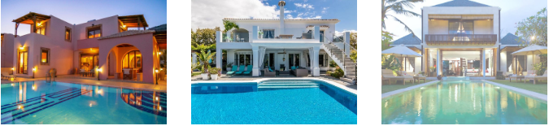
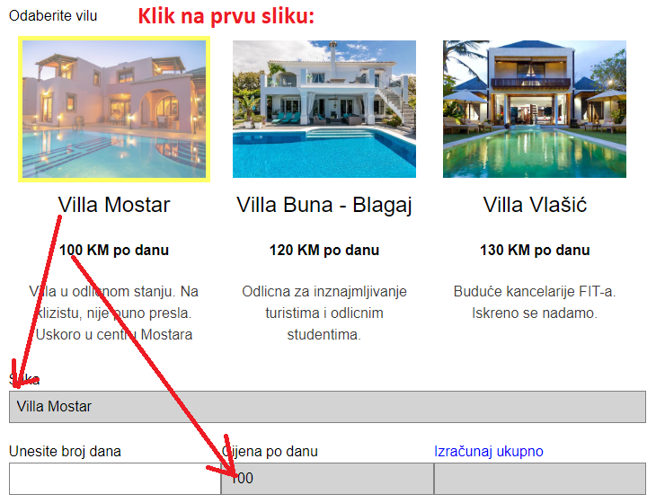
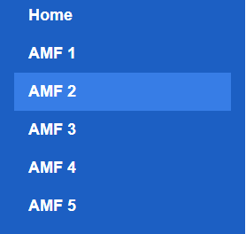
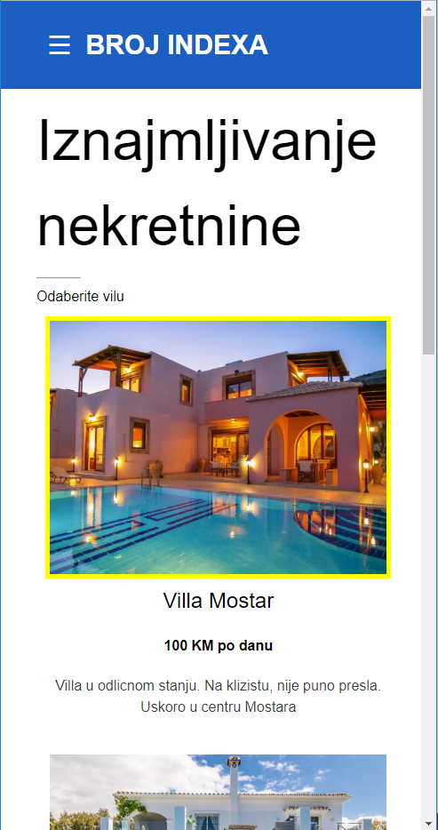

# WRD - Praktični ispit - Parcijalno

Zadatak preuzeti s ftp servera. Za izradu zadatka koristiti bilo editor po želji. U rješenju posebno razdvojiti css, html i js fileove. Folder koji sadrži sve potrebne file-ove imenovati brojem, zapakovati u ZIP format i postaviti na ftp. Obratiti pozornost na minimizaciju HTML/CSS te JavaScript koda koja, kod svakog zadatka, donosi veći broj bodova.
Podaci za pristup FTP Serveru:
*	Username: student_eb
*	Password: student_eb

## Zadatak 1 (HTML+CSS) (ukupno 30 bodova):

Prema priloženoj formi stranica.jpg markup-u Ispit.html napraviti HTML stranicu s pripadajućim css-om. Stavke na navigacijskom menu-u mijenjaju boju prilikom hovera mišem. Izgled navigacijskog menija pogledati u priloženom file-u CSS Menu.jpg

## Zadatak 2 (HTML+CSS responsive stranica za mobilne uređaje) (ukupno 30 bodova):

Prema priloženoj formi stranica.jpg uciniti HTML stranicu iz zadatka 1 responsivnom da bude prilagođena mobilnim uređajima. Promjena izgleda stranice treba se desiti kada širina prozora browser-a postanje manja od 600px. Stavke na navigacijskom menu-u mijenjaju boju prilikom hovera mišem. Izgled navigacijskog menija pogledati u priloženom file-u CSS Menu1.jpg. 

## Zadatak 3 (JavaScript) (Ukupno 40 bodova):

Ostvariti slijedeće funkcionalnosti:
* Klikom na sliku 
    * Unijeti ime vile u pojlje „Slika“ na formi.
    * Unijeti jediničnu cijenu iznajmljivanja po danu
* Omogućiti korisniku da poslije unosa broja dana, klikom na labelu „Izračunaj ukupno“ dobije ukupnu cijenu koja ce biti umnozak broja dana i cijene izabrane nekretnine.

**Napomena: U prilogu se nalaze se sintaksni potsjetnici za HTML i CSS.**

Kotiranje stranice:

Za ostatak stranice koji nije kotiran, procijeniti veličinu prema slici.
Obratiti pažnju na scroll bar sa desne strane. Pomoć: 
* odnosi se samo na desni div,
* moguće rješenje:
    * nav postaviti kao fixed a wrapper postaviti lijevu marginu veću od širine nav-a, ili
    * lijevu i desnu strana postaviti kao fixed sa visinom 100%, a desnoj strani dodati overflow.

(Pomoć: Za izbor boja koristite .jpg file u prilogu. Editujte ga u Paint-u i color picker-om uzmite code boje.)

**U nastavku su print screen-ovi sa detaljima izgleda i funkcionalnosti**

**Osnovni izgled stranice**

**Izgled donjeg djela desne strane**

**Klikom na sliku, slika dobova žuti okvir (JavaScript)**

**Hover pointerom preko slike rezultira implementacijom opacity 80% (CSS).**

**Izgled menija na hover (CSS)**

**Izgled stranice na mobilnom uređaju (ispod 600px širine)**

**Slike su jedna ispod druge.**

 

 