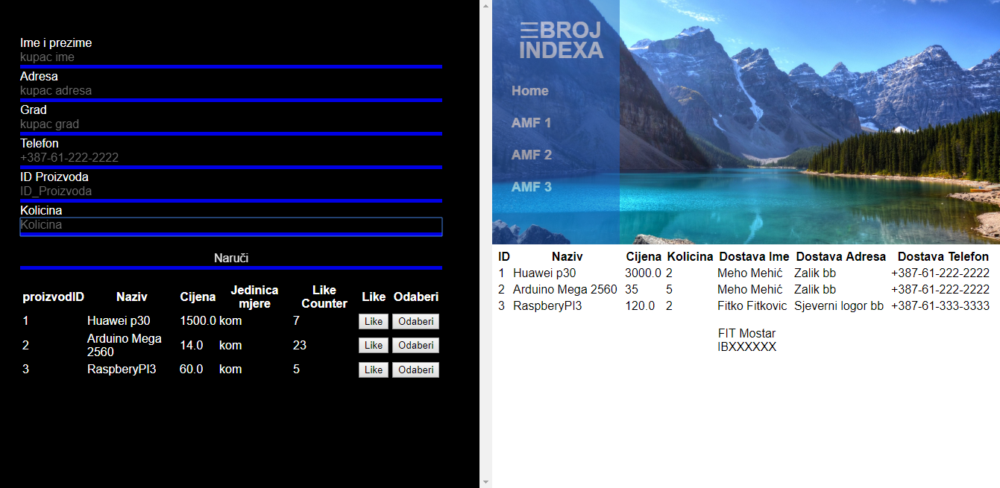
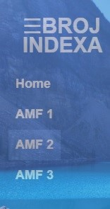

# WRD - Praktični ispit - Parcijalno i integralno

Zadatak preuzeti s ftp servera. Za izradu zadatka koristiti bilo editor po želji. U rješenju posebno razdvojiti css, html i js fileove. Folder koji sadrži sve potrebne file-ove imenovati brojem indexa sa naznakom „integralno“ ili „parcijalno“, zapakovati u ZIP format i postaviti na ftp u odgovarajuci folder (primjer imena file-a IB111111.zip ili IB222222.zip). Obratiti pozornost na minimizaciju HTML/CSS te JavaScript koda koja, kod svakog zadatka, donosi veći broj bodova. Studenti koji ispit rade integralno rade sve zadtke. Studenti koji rade drugi parcijalni ispit, trebaju uraditi samo zadatke 3 i 4.
Po potrebi mozete ukljucti jQuery, jQuery UI i jQuery validator biblioteke.
Podaci za pristup FTP Serveru:
* Username: student_eb
* Password: student_eb

## Zadatak 1 (HTML+CSS) (ukupno 30 bodova – samo Integralno) :

Prema priloženoj formi WRDStranica.jpg markup-u WRD_ispit.html napraviti HTML stranicu s pripadajućim css-om. Stavke na navigacijskom menu-u mijenjaju boju prilikom hovera mišem. Izgled navigacijskog menija pogledati u priloženom file-u WRDMenu.jpg

## Zadatak 2 (HTML+CSS responsive stranica za mobilne uređaje – samo Integralno) (ukupno 20 bodova) :

Prema priloženoj formi WRDResponsive.jpg uciniti HTML stranicu iz zadatka 1 responsivnom da bude prilagođena mobilnim uređajima. Promjena izgleda stranice treba se desiti kada širina prozora browser-a postanje manja od 600px. Stavke na navigacijskom menu-u mijenjaju boju prilikom hovera mišem. Izgled navigacijskog menija pogledati u nastavku ove specifikacije u djelu Izgled menija na hover (CSS). 

## Zadatak 3 (JavaScript ili jQuery validacija) 

*Integralno: Ukupno 10 bodova*  
*Drugi parcijalni: Ukupno 20 bodova (raditi na file-u wrd2parc.html)*

Ostvariti validaciju podataka u input box na slijedeci nacin:
* Ime – tekstualni podaci, dvije rijeci, prva velika slova u svakoj rijeci
* Adresa – tekstualni podaci
* Postanski broj – numericki, 5 cifara
* Broj telefona – format: +111-11-111-1111

## Zadatak 4 (JavaScript ili jQuery CRUD):

*Integralno: Ukupno 40 bodova*  
*Drugi parcijalni: Ukupno 80 bodova* 

Obezbjediti slijedeće funkcionalnosti:
* U tabelu prema primjeru u HTML file-u, učitati sve proizvode koristeći https://onlineshop.wrd.app.fit.ba/api/ispit20190829/Narudzba/GetProizvodiAll Uz učitavanje tabele kreirati odgovarajuću dugmad za „Like“ i „Izaberi“ funkcionalnosti.
* Klikom na dugme „Like“ pomoću https://onlineshop.wrd.app.fit.ba/api/ispit20190829/Narudzba/Like?proizvodId=1 (umjesto broja 1 poslati odgovarajući ID proizvoda koji korisnik želi) uvećati broj like-ova za taj proizvod. Poslije izvrsene akcije, reload-ati podatke kako bi se vidjeo novi broj like-ova
* Klikom na dugme „Izaberi“, upisati ID izabranog proizvoda u text polje predviđeno da ID proizvoda,
* Klikom na dugme „Naruči“ izvršiti narudžbu proizvoda pomoću http://onlineshop.wrd.app.fit.ba/api/ispit20190829/Narudzba/Dodaj

Podatke poslati u JSON formatu (POST). Primjer podataka: 
```json
{
    "dostavaGrad": "Mostar",
    "dostavaAdresa": "Sjeverni logor bb",
    "dostavaIme": "Elmir Babovic",
    "dostavaTelefon": "061711000",
    "proizvodId": 1,
    "kolicina": 2
}
```

(Podatke preuzeti iz text polja) Poslije izvršene narudžbe, učitati sve narudžbe pomoću https://onlineshop.wrd.app.fit.ba/api/ispit20190829/Narudzba/GetNarudzbeAll i upisati ih u odgovarajuću tabelu prema primjeru u HTML file-u. Zbog olakšanja rješenja, nije potrebno filtrirati narudžbe. Dovoljno je prikazati sve.

Bonus zadatak (dodatnih 10 bodova): Umjesto prikaza svih narudžbi, filtrirati narudžbe prema imenu naručioca.

**Napomena: U prilogu se nalaze se sintaksni potsjetnici za HTML, CSS i jQuery.**

**Kotiranje stranice**



Za ostatak stranice koji nije kotiran, procijeniti veličinu prema slici.
Obratiti pažnju na scroll bar sa desne strane. Pomoć: 
* odnosi se samo na desni div,
* moguće rješenje:
    * nav postaviti kao fixed a wrapper postaviti lijevu marginu veću od širine nav-a, ili
    * lijevu i desnu strana postaviti kao fixed sa visinom 100%, a desnoj strani dodati overflow.


**U nastavku su print screen-ovi sa detaljima izgleda i funkcionalnosti**

**Osnovni izgled stranice**


**Izgled menija na hover (CSS)**



**Izgled stranice na mobilnom uređaju (ispod 600px širine)**


